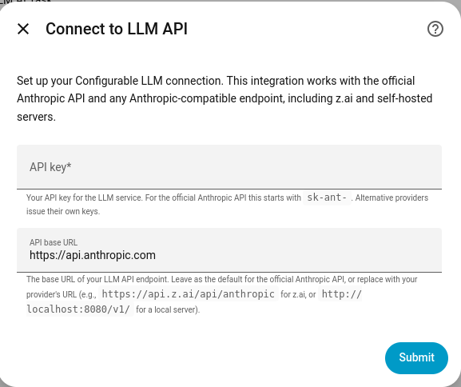
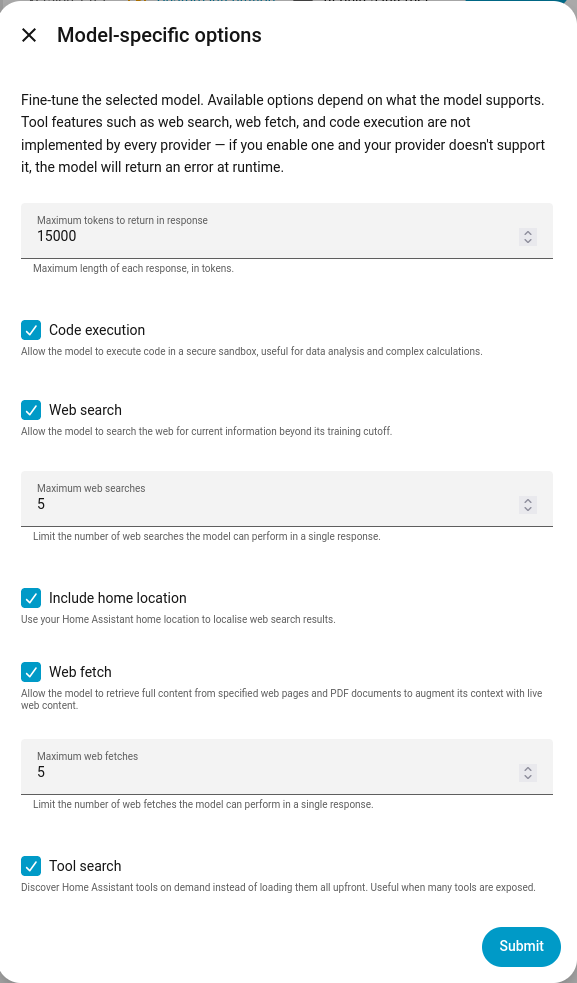

# Configurable LLM for Home Assistant

[](https://opensource.org/licenses/MIT)
[](https://www.home-assistant.io/)
[](https://hacs.xyz/)

A Home Assistant integration that adds a conversation agent and AI task entity backed by any Anthropic-compatible API endpoint. Based on the official Home Assistant Anthropic integration, with a single key addition: a configurable base URL field so the same code works against the official Anthropic API, any Anthropic-compatible provider, or a self-hosted server.

The integration covers everything the official Anthropic integration does (subentries, prompt caching, thinking budget, web search, web fetch, code execution, tool search, AI tasks) and stays in sync with upstream when those features change.

## When this might help you

- You're using a non-Anthropic provider that exposes an Anthropic-compatible API
- You're running a local LLM server (llama.cpp, vLLM, LM Studio, etc.) that speaks the Anthropic protocol
- You want to keep the official Anthropic integration installed and have a separate provider configured side-by-side

If you're using the official Anthropic API directly, you should use Home Assistant's built-in Anthropic integration instead — this integration doesn't add anything for that case.

## Installation

### Requirements

- Home Assistant **2025.8** or newer
- An API key for an Anthropic-compatible service

### Via HACS (recommended)

[](https://my.home-assistant.io/redirect/hacs_repository/?owner=imonlinux&repository=configurable-llm&category=integration)

1. Open HACS in Home Assistant
2. Click the three-dot menu → **Custom repositories**
3. Add `https://github.com/imonlinux/configurable-llm` with category **Integration**
4. Find **Configurable LLM** in the HACS list and install it
5. Restart Home Assistant

### Manual installation

```bash
# From the root of your Home Assistant config directory
git clone https://github.com/imonlinux/configurable-llm.git /tmp/configurable-llm
mkdir -p custom_components
cp -r /tmp/configurable-llm/custom_components/configurable_llm custom_components/
```

Restart Home Assistant.

## Setup

After installation, add the integration:

1. Go to **Settings → Devices & Services → Add Integration**
2. Search for **Configurable LLM**
3. Fill in the form:

   

   - **API key** — your provider's API key
   - **API base URL** — defaults to `https://api.anthropic.com`; replace with your provider's URL

For provider-specific URLs and API key formats, see [docs/PROVIDERS.md](docs/PROVIDERS.md).

Once the form is submitted the integration creates two default subentries:

- A **conversation agent** named "LLM Conversation"
- An **AI task** named "LLM AI Task"

Each subentry can be configured independently from the integration's card under **Settings → Devices & Services**.

## Configuration

The integration is configured entirely through the Home Assistant UI — there is no YAML configuration.

Each conversation agent or AI task subentry has two configuration modes:

- **Recommended model settings** (default) — uses the first model returned by the provider and sensible defaults. No further configuration needed.
- **Custom settings** — turn off "Recommended model settings" to access the full set of options below.

### Basic settings

| Field | Description |
|---|---|
| Name | Display name for this conversation agent or AI task |
| Instructions | System prompt sent to the model (Jinja templating supported) |
| Control Home Assistant | Which Home Assistant LLM APIs the agent can use to control devices |

### Advanced settings

| Field | Description |
|---|---|
| Model | The model ID to use. A list is populated from the provider's `/v1/models` endpoint if available; otherwise you can type a model ID directly. |
| Caching strategy | Off, system prompt only, or full caching |

### Model-specific options

The fields available here depend on what the selected model reports it supports. A typical set looks like this:



| Field | Description |
|---|---|
| Maximum tokens | Cap on the length of each response |
| Thinking budget / Thinking effort | Reserved tokens for the model's internal reasoning (shown only when the model supports extended thinking) |
| Code execution | Lets the model run code in a sandbox |
| Web search | Lets the model issue search queries |
| Maximum web searches | Cap on search queries per response |
| Include home location | Localizes search results using your HA home zone |
| Web fetch | Lets the model retrieve full content from a specific URL or PDF |
| Maximum web fetches | Cap on URL fetches per response |
| Tool search | Discover Home Assistant tools on demand instead of loading them all upfront |

Tool features (code execution, web search, web fetch, tool search) are not implemented by every provider. If you enable a feature your provider doesn't support, the model will return an error at runtime — the integration won't pre-filter what's offered.

## Updating

### Via HACS

HACS will notify you when a new release is available. Click **Update**, then restart Home Assistant.

### Manual

```bash
cd /tmp/configurable-llm
git pull
cp -r custom_components/configurable_llm /path/to/homeassistant/custom_components/
```

Restart Home Assistant.

## Uninstalling

1. **Settings → Devices & Services**, find Configurable LLM, click the three-dot menu → **Delete**
2. Restart Home Assistant
3. For HACS installs: open HACS, find Configurable LLM, three-dot menu → **Remove**. For manual installs: delete the `custom_components/configurable_llm` directory.

## Troubleshooting

### The integration won't load

Check the Home Assistant log (`Settings → System → Logs`). The most common causes:

- **HA version too old** — this integration requires HA 2025.8 or newer because it uses AI task entities and config subentries
- **SDK install failed** — the integration pulls `anthropic==0.96.0`; pip needs network access on first load

### Authentication fails

- The form treats `sk-ant-...`-style keys as the canonical Anthropic format, but the field accepts any string. The provider's authentication is what validates the key, so check the key against your provider's docs.
- For local servers that don't authenticate, supply any non-empty string in the API key field.

### "Invalid API endpoint" on the setup form

The integration validates the base URL by listing models against it during setup. This error usually means one of:

- The URL is wrong for your provider (see [docs/PROVIDERS.md](docs/PROVIDERS.md))
- The path is missing or extra (e.g., missing `/v1/` or `/api/anthropic`)
- The provider doesn't expose a `/v1/models` endpoint — in this case, the URL is probably right but the integration can't auto-validate it. Try setting the provider up via API console first to confirm it answers, then ignore this error (the integration may still work).

### Empty model dropdown

The provider's `/v1/models` endpoint returned an empty list or doesn't exist. The model field accepts custom values — type the model ID directly and it will be used.

### A tool feature returns an error from the provider

Not every Anthropic-compatible provider supports every tool. Turn off the feature in the conversation or AI task subentry. The error message in the HA log usually identifies which tool the provider rejected.

### Debug logging

```yaml
# configuration.yaml
logger:
  default: info
  logs:
    custom_components.configurable_llm: debug
```

## Compatibility notes

| Capability | Official Anthropic | Most Anthropic-compatible providers | Self-hosted / local |
|---|---|---|---|
| Conversation | ✅ | ✅ | ✅ (depends on server) |
| AI Task | ✅ | ✅ | ✅ (depends on server) |
| Tool calls (HA entities) | ✅ | usually ✅ | often ✅ |
| Prompt caching | ✅ | maybe | usually no |
| Thinking budget / effort | ✅ | varies | usually no |
| Web search | ✅ | varies | usually no |
| Web fetch | ✅ | varies | usually no |
| Code execution | ✅ | varies | usually no |
| Structured outputs (AI Task) | ✅ | varies | usually no |

The integration doesn't probe for these — it surfaces whatever the model's `/v1/models` metadata reports it supports, then lets you opt in to the rest. If a feature isn't supported and you enable it, you'll see an error from the provider at runtime.

## Contributing

This component tracks the upstream [Home Assistant Anthropic integration](https://github.com/home-assistant/core/tree/dev/homeassistant/components/anthropic) closely. Patches that bring it further in line with upstream — especially as new Anthropic API features land — are welcome. Patches that fork its behavior should explain why.

**Issues:** https://github.com/imonlinux/configurable-llm/issues

## License

MIT — see [LICENSE](LICENSE).

## Credits

Based on the [Home Assistant Anthropic integration](https://github.com/home-assistant/core/tree/dev/homeassistant/components/anthropic). All credit for the core conversation, AI task, tool, and config-flow architecture goes to that project and its contributors.
