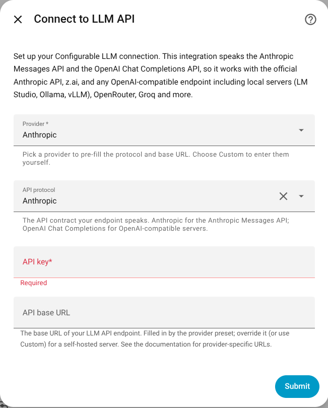
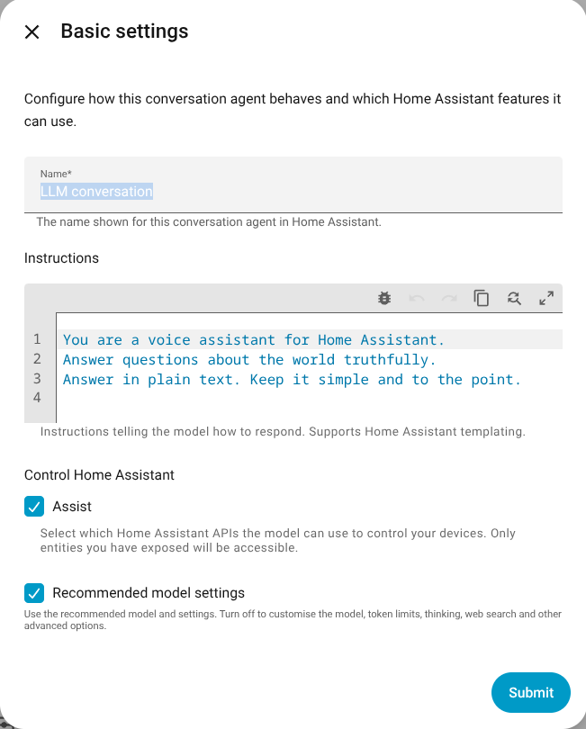
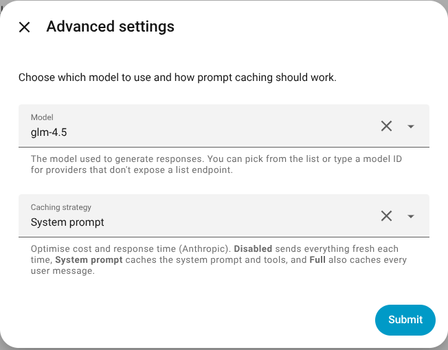
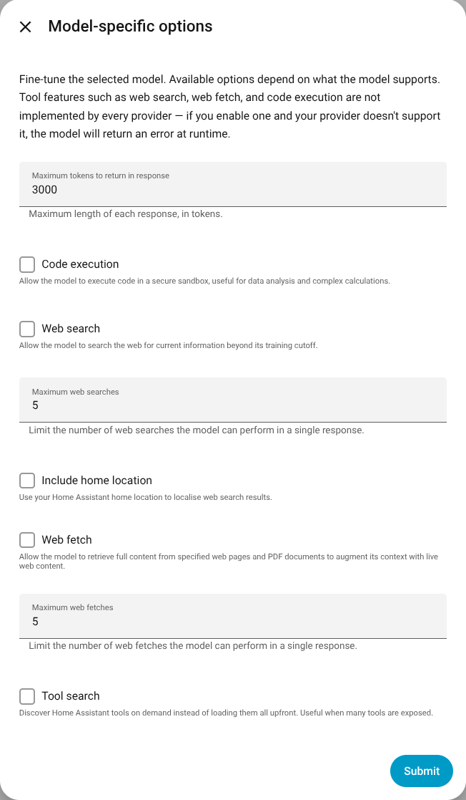

# Configurable LLM for Home Assistant

[](https://opensource.org/licenses/MIT)
[](https://www.home-assistant.io/)
[](https://hacs.xyz/)

A Home Assistant integration that adds a conversation agent and AI task entity backed by any Anthropic- or OpenAI-compatible API endpoint. Based on the official Home Assistant Anthropic integration, extended with a provider-pluggable architecture and configurable base URLs.

The integration supports two major API protocols:
- **Anthropic Messages API** — Official Anthropic API, z.ai, and Anthropic-compatible proxies
- **OpenAI Chat Completions** — OpenAI, OpenRouter, Groq, Together, Ollama, LM Studio, vLLM, and self-hosted servers

## When this might help you

- You're using a non-Anthropic provider that exposes an Anthropic-compatible API (e.g., z.ai)
- You're using an OpenAI-compatible provider or local LLM server
- You want to run local LLMs (Ollama, LM Studio, vLLM, llama.cpp) with Home Assistant's conversation and AI task features
- You want to keep the official integrations installed and have a separate provider configured side-by-side

If you're using the official Anthropic or OpenAI APIs directly, you should use Home Assistant's built-in integrations instead — this integration is designed for alternative and self-hosted endpoints.

## Installation

### Requirements

- Home Assistant **2025.8** or newer
- An API key for an Anthropic- or OpenAI-compatible service

### Via HACS (recommended)

[](https://my.home-assistant.io/redirect/hacs_repository/?owner=imonlinux&repository=configurable-llm&category=integration)

1. Open HACS in Home Assistant
2. Click the three-dot menu → **Custom repositories**
3. Add `https://github.com/imonlinux/configurable-llm` with category **Integration**
4. Find **Configurable LLM** in the HACS list and install it
5. Restart Home Assistant

### Manual installation

```bash
# From the root of your Home Assistant config directory
git clone https://github.com/imonlinux/configurable-llm.git /tmp/configurable-llm
mkdir -p custom_components
cp -r /tmp/configurable-llm/custom_components/configurable_llm custom_components/
```

Restart Home Assistant.

## Setup

After installation, add the integration:

1. Go to **Settings → Devices & Services → Add Integration**
2. Search for **Configurable LLM**
3. Fill in the form:

   

   - **Provider** — choose a preset (Anthropic, z.ai, OpenAI, OpenRouter, Groq, Ollama, LM Studio) or Custom
   - **API protocol** — auto-selected by provider; can be overridden with Custom
   - **API key** — your provider's API key
   - **API base URL** — auto-filled by preset; enter manually for Custom

For provider-specific URLs and API key formats, see [docs/PROVIDERS.md](docs/PROVIDERS.md).

Once the form is submitted the integration creates two default subentries:

- A **conversation agent** named "LLM conversation"
- An **AI task** named "LLM AI Task"

Each subentry can be configured independently from the integration's card under **Settings → Devices & Services**.

## Configuration

The integration is configured entirely through the Home Assistant UI — there is no YAML configuration.

Each conversation agent or AI task subentry has two configuration modes:

- **Recommended model settings** (default) — uses sensible defaults for the selected protocol. No further configuration needed.
- **Custom settings** — turn off "Recommended model settings" to access the full set of options below.

### Basic settings

| Field | Description |
|---|---|
| Name | Display name for this conversation agent or AI task |
| Instructions | System prompt sent to the model (Jinja templating supported) |
| Control Home Assistant | Which Home Assistant LLM APIs the agent can use to control devices |



### Advanced settings

| Field | Description |
|---|---|
| Model | The model ID to use. A list is populated from the provider's `/v1/models` endpoint if available; otherwise you can type a model ID directly. |
| Caching strategy | Disabled, System prompt, or Full (Anthropic protocol) |



### Anthropic protocol options


| Field | Description |
|---|---|
| Maximum tokens | Cap on the length of each response |
| Thinking budget / Thinking effort | Reserved tokens for the model's internal reasoning (shown only when the model supports extended thinking) |
| Code execution | Lets the model run code in a sandbox |
| Web search | Lets the model issue search queries |
| Maximum web searches | Cap on search queries per response |
| Include home location | Localizes search results using your HA home zone |
| Web fetch | Lets the model retrieve full content from a specific URL or PDF |
| Maximum web fetches | Cap on URL fetches per response |
| Tool search | Discover Home Assistant tools on demand instead of loading them all upfront |



### OpenAI Chat Completions protocol options

| Field | Description |
|---|---|
| Temperature | Controls randomness in responses (0.0 - 2.0) |
| Top P | Nucleus sampling threshold (0.0 - 1.0) |
| Reasoning effort | Effort level for reasoning models (none/low/medium/high) |
| Maximum tokens | Cap on the length of each response |

The Anthropic-protocol tool features (code execution, web search, web fetch, tool search) are not available on the OpenAI Chat Completions rail — those options only appear on Anthropic-protocol subentries. Home Assistant tool calling (device control) works on both protocols, subject to the model and server supporting function calls.

> **Note:** OpenAI-hosted reasoning models (o-series, gpt-5) are not supported on this rail. They reject `max_tokens` and non-default temperature. Use chat models (e.g., `gpt-4o-mini`) or compatible/local servers.

## Provider presets

The following presets are available at setup:

| Provider | Protocol | Base URL |
|---|---|---|
| Anthropic | Anthropic | `https://api.anthropic.com` |
| z.ai | Anthropic | `https://api.z.ai/api/anthropic` |
| OpenAI | OpenAI | `https://api.openai.com/v1` |
| OpenRouter | OpenAI | `https://openrouter.ai/api/v1` |
| Groq | OpenAI | `https://api.groq.com/openai/v1` |
| Ollama | OpenAI | `http://localhost:11434/v1` |
| LM Studio | OpenAI | `http://localhost:1234/v1` |
| Custom | Both | (enter manually) |

Choose **Custom** to manually specify both the protocol and base URL for unsupported providers.

## Updating

### Via HACS

HACS will notify you when a new release is available. Click **Update**, then restart Home Assistant.

Upgrading from 1.1.x is automatic — existing config entries are migrated in place (they're stamped with the Anthropic protocol they were implicitly using), and no reconfiguration is needed.

### Manual

```bash
cd /tmp/configurable-llm
git pull
cp -r custom_components/configurable_llm /path/to/homeassistant/custom_components/
```

Restart Home Assistant.

## Uninstalling

1. **Settings → Devices & Services**, find Configurable LLM, click the three-dot menu → **Delete**
2. Restart Home Assistant
3. For HACS installs: open HACS, find Configurable LLM, three-dot menu → **Remove**. For manual installs: delete the `custom_components/configurable_llm` directory.

## Troubleshooting

### The integration won't load

Check the Home Assistant log (`Settings → System → Logs`). The most common causes:

- **HA version too old** — this integration requires HA 2025.8 or newer because it uses AI task entities and config subentries
- **SDK install failed** — the integration pulls `anthropic==0.96.0` and `openai==2.21.0`; pip needs network access on first load

### Authentication fails

- The form treats `sk-ant-...`-style keys as the canonical Anthropic format, but the field accepts any string. The provider's authentication is what validates the key, so check the key against your provider's docs.
- For local servers that don't authenticate, supply any non-empty string in the API key field.

### "Invalid API endpoint" on the setup form

The integration validates the base URL by listing models against it during setup. This error usually means one of:

- The URL is wrong for your provider (see [docs/PROVIDERS.md](docs/PROVIDERS.md))
- The path is missing or extra (e.g., missing `/v1/` or `/api/anthropic`)
- The provider doesn't expose a `/v1/models` endpoint — in this case, the URL is probably right but the integration can't auto-validate it. Try setting the provider up via API console first to confirm it answers, then ignore this error (the integration may still work).

### Empty model dropdown

The provider's `/v1/models` endpoint returned an empty list or doesn't exist. The model field accepts custom values — type the model ID directly and it will be used.

### A tool feature returns an error from the provider

Not every Anthropic- or OpenAI-compatible provider supports every tool. Turn off the feature in the conversation or AI task subentry. The error message in the HA log usually identifies which tool the provider rejected.

### Debug logging

```yaml
# configuration.yaml
logger:
  default: info
  logs:
    custom_components.configurable_llm: debug
```

## Compatibility notes

| Capability | Anthropic Protocol | OpenAI Protocol |
|---|---|---|
| Conversation | ✅ | ✅ |
| AI Task | ✅ | ✅ |
| Tool calls (HA entities) | ✅ | ✅ (model/server-dependent) |
| Prompt caching | ✅ | ❌ |
| Thinking budget / effort | ✅ | ❌ (use reasoning effort) |
| Web search | ✅ | ❌ |
| Web fetch | ✅ | ❌ |
| Code execution | ✅ | ❌ |
| Structured outputs (AI Task) | ✅ | ✅ via `json_schema` (server-dependent) |

On the Anthropic protocol, the thinking options appear only when the model's `/v1/models` metadata reports thinking support; the other tool toggles are offered unconditionally and validated by the provider at runtime — if your provider doesn't support one you enabled, you'll see an error in the response. On the OpenAI protocol, only the options listed in its table above are offered.

## Contributing

This component tracks the upstream [Home Assistant Anthropic integration](https://github.com/home-assistant/core/tree/dev/homeassistant/components/anthropic) closely. Patches that bring it further in line with upstream — especially as new Anthropic API features land — are welcome. Patches that fork its behavior should explain why.

**Issues:** https://github.com/imonlinux/configurable-llm/issues

## License

MIT — see [LICENSE](LICENSE).

## Credits

Based on the [Home Assistant Anthropic integration](https://github.com/home-assistant/core/tree/dev/homeassistant/components/anthropic). All credit for the core conversation, AI task, tool, and config-flow architecture goes to that project and its contributors.

OpenAI Chat Completions support references the [Home Assistant OpenAI integration](https://github.com/home-assistant/core/tree/dev/homeassistant/components/openai) for protocol patterns and request/response handling.
